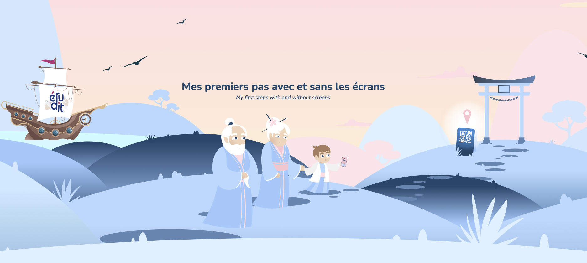

# Erudit Architecture Overview

> **Note:** This repository is a public showcase of the architecture and technical challenges behind **Erudit**, a private closed-source Flutter application. The actual source code is not provided here.

 

  

  

    A robust Flutter application to discover cultural anecdotes and remember them forever using Spaced Repetition.
     
    <a href="https://erudit.app"><strong>Visit the website »</strong></a>
  

---

## About The Project

**Erudit** is a mobile application designed to automate the discovery and retention of cultural anecdotes. It leverages a set of generative AI models to produce short stories, enriched with images, voice-over, subtitles, and music. 

This document outlines the architectural decisions and the complex engineering challenges overcome to deliver a seamless, offline-first, media-heavy experience. The core design philosophy centers on extreme modularity, strict separation of concerns (Domain, Infrastructure, UI), and testability.

### Built With

* 
* 
* 
*  (for AI generation pipelines)

---

## Key Engineering Challenges & Solutions

Building Erudit required solving several complex technical challenges, particularly around media synchronization, massive asset management, scalable AI content generation, and offline capabilities.

### 1. The "Measure" Synchronization System
Anecdotes are not static screens; they are dynamic, multi-media presentations. To handle this, I engineered a highly decoupled **Measure System** acting as a finite state machine.

* **The Problem**: Synchronizing audio playback (voice-overs and background music), visual animations, and text rendering across dynamic durations is notoriously difficult in Flutter, often leading to spaghetti code tightly coupled to the UI layer.
* **The Architecture**: I abstracted an anecdote into an ordered list of `Measure` entities. A `Measure` represents a self-contained temporal segment (e.g., a single sentence with its associated visual state). 
* **The Implementation**: 
  * A `MeasureBuilderRegistry` maps abstract measure types to specific UI builders dynamically at runtime.
  * A `MeasureWidgetController` orchestrates the flow. It listens to audio completion streams and animation controllers, determining exactly when to transition to the next `Measure` or pause the progression.
* **The Result**: The UI layer simply reacts to the `Measure` state. This complete decoupling allows us to add new types of interactive segments without touching the core playback logic, and it makes the entire media progression fully unit-testable without rendering a single widget.

### 2. Spaced Repetition System (SRS)
The core value proposition of Erudit is not just discovering anecdotes, but *remembering* them. 

* **The Problem**: Retaining information over time requires scientifically proven review schedules. A simple daily review queue is insufficient; the schedule must adapt to the user's specific memory performance for each individual anecdote.
* **The Architecture**: I implemented a custom **Spaced Repetition System (SRS)** engine in pure Dart, isolated completely in the domain layer.
* **The Implementation**: 
  * When a user views an anecdote, their interaction (e.g., success/failure in recall, time taken) is fed into the SRS algorithm.
  * The algorithm calculates the optimal "next review date" using an adapted multiplier curve. If a user recalls a fact easily, the interval expands exponentially (1 day -> 3 days -> 10 days). If they struggle, the interval resets, ensuring they review it again soon.
  * The queue is constantly recalculated dynamically based on the current timestamp, prioritizing items that are "due" or "overdue."

### 3. Automated AI Content Generation Pipeline
> At the start of the project, we used generative AI for the artistic aspects, but that is no longer the case.

Generating rich, accurate, and multi-modal cultural stories at scale required moving beyond manual curation.

* **The Problem**: Creating a single anecdote requires writing text, translating it, recording voice-overs, finding/generating relevant imagery, removing backgrounds for UI composition, and packaging it into an app-ready format. Doing this manually is a massive bottleneck.
* **The Architecture**: I built a comprehensive backend automation pipeline using Dart CLI tools and Python scripts.
* **The Implementation**: 
  * **Text & Context**: The pipeline interacts with Generative AI APIs to draft culturally accurate stories based on specific historical epochs and geographical tags.
  * **Audio Processing**: It utilizes Text-to-Speech (TTS) services to generate natural-sounding voice-overs in multiple languages, automatically generating synchronized subtitle metadata.
  * **Visual Processing**: It generates contextual images, utilizes Python scripts with the `rembg` library to automatically strip backgrounds, and converts assets to scalable vector formats (SVG) to reduce file size without losing quality.
  * **Social Media Automation**: The pipeline includes dedicated bash scripts that assemble these assets, render them into vertical video formats, and package them for daily automated distribution across social media platforms.

### 4. Overcoming Massive Asset Limits (Play Asset Delivery)
Erudit relies heavily on high-fidelity, eternal assets (detailed SVGs, extensive voice-over libraries, and high-quality background music).

* **The Problem**: App stores impose strict limits on initial download sizes (e.g., Google Play's 150MB APK limit). Bundling all media assets would make the app impossible to publish and severely deter user installation.
* **The Architecture**: I integrated **Android Play Asset Delivery** (via custom integration wrappers).
* **The Implementation**: 
  * Assets are separated from the core app binary into "asset packs." 
  * The app is configured to fetch these large media bundles dynamically. Some are configured as `install-time` (downloaded alongside the app but not counting towards the base APK limit), while others are `on-demand` (downloaded only when the user reaches a specific content tier).
* **The Result**: The initial app download remains lean and fast, while the app can scale to gigabytes of rich media content dynamically.

### 5. Dependency Inversion in Audio Architecture
Audio is critical to the Erudit experience, but directly coupling the domain logic to a specific third-party audio player package creates massive technical debt.

* **The Problem**: If a third-party audio package is abandoned, introduces a breaking bug, or if we need to support a new platform it doesn't cover, refactoring the entire app would be necessary.
* **The Architecture**: I strictly applied the **Dependency Inversion Principle (DIP)**.
* **The Implementation**: 
  * I created a pure-Dart, abstract audio interface. The domain layer only knows about this abstract interface (e.g., `play()`, `pause()`, `seek()`, `onCompleteStream`).
  * I then created a separate infrastructure implementation that wraps a specific third-party library and implements the abstract interface.
* **The Result**: The core application logic has zero dependencies on any Flutter plugins. We can swap the entire audio engine underneath the app with a different package by simply changing one dependency injection binding, ensuring long-term maintainability.

### 6. Offline-First Resilience
Users expect to review their anecdotes seamlessly on the subway, in airplane mode, or in areas with spotty connections.

* **The Problem**: Relying on live network calls for every interaction leads to a frustrating, blocking user experience. 
* **The Architecture**: An offline-first approach using state management coupled with persistent local storage.
* **The Implementation**: 
  * Every piece of critical user state—their progress, their SRS queue, and their preferences—is managed via robust state controllers.
  * The system automatically serializes this state and persists it to local device storage on every change. 
  * When the app launches, the UI instantly hydrates from the local cache. Background sync tasks detect when network connectivity is restored and silently push the local changes to the cloud, resolving any conflicts.

---

## Contact

Alexis Deslandes - [LinkedIn](https://www.linkedin.com/in/alexis-deslandes-76007a155/) - deslandes.alexis1@gmail.com
